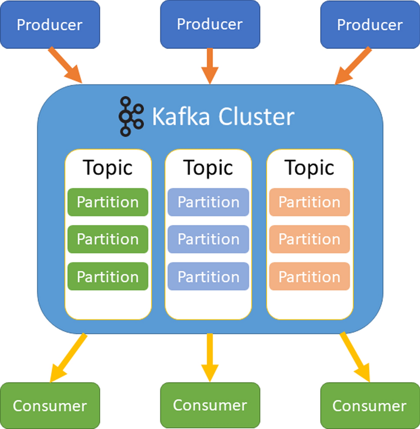

# Chapter 1: Getting Started with Apache Kafka

- [1.1 Introduction to Kafka and Event Streaming](#11-introduction-to-kafka-and-event-streaming)
- [1.2 Kafka in Modern Architecture](#12-kafka-in-modern-architecture)
- [1.3 Kafka Ecosystem Overview](#13-kafka-ecosystem-overview)
- [1.4 Kafka vs RabbitMQ vs MQTT vs Azure Event Hubs](#14-kafka-vs-rabbitmq-vs-mqtt-vs-azure-event-hubs)

---

## 1.1 Introduction to Kafka and Event Streaming

### Introduction

Apache Kafka is a distributed event streaming platform. At its core, it's a high-throughput, fault-tolerant system designed to handle real-time data feeds, known as event streams. Think of it as a central nervous system for your applications, allowing them to communicate and share data in a fast, reliable, and scalable way. Unlike traditional messaging systems that simply pass messages and then delete them, Kafka stores streams of events durably, making them available for consumption by multiple applications over time.

### Explanation: The Components of Event Streaming

The concept of event streaming revolves around treating data as a continuous stream of "events" rather than static records. An event is a single, immutable fact that happened at a specific point in time (e.g., a user clicked a button, a sensor reported a temperature, a new order was placed).

Kafka's architecture is built on a few core concepts:

- **Producers:** These are applications that publish events to Kafka. When a producer sends an event, it includes a key (e.g., a user ID) and a value (the event data).
- **Consumers:** These are applications that subscribe to and read events from Kafka. A single event can be consumed by multiple different consumers without being removed from the system.
- **Brokers:** These are the servers that form the Kafka cluster. They are responsible for storing the events. A Kafka cluster consists of one or more brokers.
- **Topics:** A topic is a category or feed name to which events are published. Events are organized by topic. For example, all events related to user sign-ups could go to a `user-signups` topic.
- **Partitions:** Topics are divided into a number of partitions. Each partition is an ordered, immutable sequence of events. Partitions are key to Kafka's scalability, as they allow a single topic to be distributed across multiple brokers and processed in parallel by consumers.

### Real-World Analogy: A High-Tech Library

Imagine a high-tech library where instead of borrowing books, people publish new chapters or articles.

- **Producers** are the authors who write a new chapter (an event) and publish it to a specific section of the library (a topic).
- The **library itself**, with its shelves and cataloging system, is the **Kafka cluster** (brokers).
- The different **sections** of the library (e.g., "Fiction," "Science," "News") are the **topics**.
- The individual **shelves** within each section are the **partitions**, holding a sequence of articles in the order they were published.
- **Consumers** are the readers who can subscribe to a specific section. When a new chapter is added, they get a copy to read. Critically, the chapter stays on the shelf for others to read later. This allows new readers to catch up on all previous chapters from the beginning.

---

## 1.2 Kafka in Modern Architecture

### Explanation: Kafka as a Central Nervous System

In a modern, microservices-based architecture, applications are often decoupled and communicate with each other. This is where Kafka excels. It acts as a central data backbone, or a "central nervous system," enabling services to communicate asynchronously without being directly dependent on each other.

Instead of `Service A` making a direct HTTP request to `Service B` (a tight coupling), `Service A` simply publishes an event to Kafka. Any service that is interested in that event (`Service B`, `Service C`, etc.) can consume it independently. This approach creates a more resilient, scalable, and loosely coupled system.

### Use Cases

Kafka's durability and high-throughput nature make it suitable for a wide range of modern use cases:

- **Building Real-Time Data Pipelines:** Kafka can be used as a high-speed data pipeline to move data between different systems, such as ingesting data from application logs into a data warehouse or an analytics platform.
- **Event Sourcing:** Since Kafka's partitions are an ordered, immutable log, you can use them to store a complete history of events that led to the current state of an application. This allows you to "reconstruct" the application's state at any point in time.
- **Stream Processing:** Applications can consume events in real-time and perform computations, transformations, or aggregations. For example, a fraud detection service could consume a stream of financial transactions to identify suspicious activity as it happens.
- **Website Activity Tracking:** Capturing user clicks, page views, and other interactions on a website or mobile app and publishing them to Kafka for real-time analytics.

---

## 1.3 Kafka Ecosystem Overview

### Explanation: Key Components

Kafka is more than just a messaging system; it's an entire platform with a rich ecosystem of tools that extend its capabilities.

- **Kafka Connect:** A framework for building and running reusable connectors that stream data between Kafka and other systems. It simplifies the process of integrating Kafka with databases (e.g., JDBC connector), file systems, search indexes (e.g., Elasticsearch), and more. Connectors come in two types: `Source` connectors (ingesting data into Kafka) and `Sink` connectors (exporting data out of Kafka).
- **Kafka Streams:** A powerful client library for building applications that process data stored in Kafka. It allows developers to write real-time stream processing jobs using standard Java or Scala. Kafka Streams is designed to be lightweight, easy to use, and does not require a separate processing cluster.
- **ksqlDB:** An event streaming database built on top of Kafka. It provides a simple, familiar SQL-like interface for writing stream processing applications. It's ideal for developers who want to perform real-time data transformations, aggregations, and enrichments without having to write code in a programming language like Java.
- **ZooKeeper (Historical Role):** In earlier versions of Kafka, ZooKeeper was a critical component used to manage the Kafka cluster, including broker health, topic configurations, and access control lists. **Important Note:** In recent versions (starting with KIP-500), Kafka is moving away from ZooKeeper and adopting a new consensus protocol called KRaft, which will remove the external dependency and simplify the architecture. For an intermediate user, it's good to be aware of ZooKeeper's historical role and the ongoing shift.

---

## 1.4 Kafka vs RabbitMQ vs MQTT vs Azure Event Hubs

### Explanation: Choosing the Right Tool

While these technologies may seem similar, they are designed for different purposes and have distinct characteristics.

| Feature                  | Apache Kafka                                          | RabbitMQ                                             | MQTT                                                      | Azure Event Hubs                                      |
| :----------------------- | :---------------------------------------------------- | :--------------------------------------------------- | :-------------------------------------------------------- | :---------------------------------------------------- |
| **Core Philosophy**      | Distributed Event Streaming Platform                  | Traditional Message Broker                           | Lightweight IoT Protocol                                  | Managed Event Ingestion Service                       |
| **Messaging Pattern**    | Publish-Subscribe, based on an immutable log          | Publish-Subscribe, Point-to-Point, Request-Reply     | Publish-Subscribe                                         | Publish-Subscribe (Kafka-compatible endpoint)         |
| **Data Durability**      | Highly durable, events stored for a configurable time | Messages are consumed and deleted from the queue     | Messages are transient and can be persisted by the broker | Highly durable, events stored for a configurable time |
| **Throughput & Latency** | Designed for high-throughput, can have higher latency | Optimized for low-latency, reliable message delivery | Designed for low bandwidth & low power devices            | High-throughput, managed by Microsoft                 |
| **Consumer Model**       | Pull-based: Consumers pull data from partitions       | Push-based: Broker pushes messages to consumers      | Push-based: Broker pushes messages to clients             | Pull-based: Consumers pull data                       |
| **Primary Use Case**     | Event streaming, data pipelines, log aggregation      | Task queues, microservice communication, routing     | IoT telemetry, mobile messaging, low-power apps           | Ingesting massive amounts of event data               |
| **Ecosystem & Tools**    | Extensive ecosystem (Connect, Streams, ksqlDB)        | Plugins, rich routing capabilities                   | Protocol specification, requires a broker                 | Part of the broader Azure ecosystem                   |

### Pros and Cons of Each

#### Kafka:

- **Pros:** High-throughput, fault-tolerant, scalable, durable event storage, and a rich ecosystem for stream processing and data integration.
- **Cons:** Can be complex to set up and manage a self-hosted cluster, higher latency for very specific low-latency use cases, and requires significant resources.

#### RabbitMQ:

- **Pros:** Mature, robust, excellent for complex routing, and guarantees message delivery. It's often easier to get started with than Kafka for basic use cases.
- **Cons:** Not designed for high-volume event streaming or long-term data storage. Messages are typically deleted after consumption.

#### MQTT:

- **Pros:** Extremely lightweight and efficient for resource-constrained devices, minimal overhead.
- **Cons:** It's just a protocol, not a full platform. It lacks the advanced features and durability of Kafka and RabbitMQ on.
  
#### Azure Event Hubs:

- **Pros:** Fully managed, highly scalable, and simple to use as a service. It has a Kafka-compatible endpoint, making it easy to migrate some Kafka applications.
- **Cons:** Vendor lock-in, less control over the underlying infrastructure, and it doesn't provide the full Kafka ecosystem (e.g., Kafka Streams, Connect).

---

[Kafka Broker, Kafka Topic, Consumer and Record flow in Kafka](https://kajalrawal.medium.com/kafka-broker-kafka-topic-consumer-and-record-flow-in-kafka-ec55104977b8)

[Kafka Producer and Consumer](https://medium.com/@cobch7/kafka-producer-and-consumer-f1f6390994fc)

[Kafka Architecture](https://medium.com/@cobch7/kafka-architecture-43333849e0f4)
