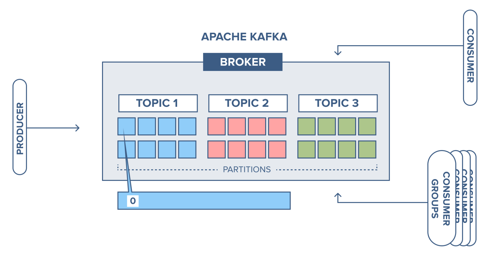

# Chapter 2: Kafka Core Concepts & Architecture

- [2.1 Kafka Brokers and Clusters](#21-kafka-brokers-and-clusters)
- [2.2 Topics and Partitions](#22-topics-and-partitions)
- [2.3 Producers and Consumers](#23-producers-and-consumers)
- [2.4 Replication and In-Sync Replicas](#24-replication-and-in-sync-replicas)
- [2.5 Zookeeper vs KRaft](#25-zookeeper-vs-kraft)

---

## 2.1 Kafka Brokers and Clusters

### Introduction

At its most fundamental level, a Kafka deployment is a cluster of one or more servers, known as brokers. The cluster architecture is what provides Kafka with its scalability, fault tolerance, and high availability.

### Explanation

- **Kafka Broker:** A single Kafka server is called a broker. It's responsible for storing events, handling producer requests to write data, and consumer requests to read data. Each broker is identified by a unique integer ID within the cluster.
- **Kafka Cluster:** A collection of brokers that work together. For a cluster to be functional, a minimum of three brokers is recommended to ensure high availability. Within a cluster, one broker is designated as the controller. The controller's primary role is to manage the cluster's state. This includes tasks like assigning partitions to brokers, monitoring broker health, and handling leadership elections for partitions. The controller's role is critical, and a new one is automatically elected if the current one fails.

**How they work:** When you produce or consume an event, you don't connect to a specific broker. Instead, you connect to the entire cluster via a list of "bootstrap" brokers. The client library then figures out which specific broker is the leader for the partition it needs to interact with. This transparent routing is key to the client's simplicity and the cluster's resilience.

---

## 2.2 Topics and Partitions

### Introduction

While an event is the smallest unit of data in Kafka, topics and partitions are the fundamental structures for organizing and distributing those events.

### Explanation

- **Topics:** A topic is a logical category or feed name to which events are published. It's an ordered sequence of events. For example, you might have a `user-clicks` topic and a `stock-trades` topic.
- **Partitions:** This is where Kafka's scalability is unlocked. A topic is divided into a number of partitions. Each partition is an ordered, immutable sequence of events. Critically, the ordering of events is guaranteed only within a partition. There is no global order across the entire topic.

**The Role of Partitioning:**

- **Parallelism:** Partitions allow a topic to be distributed across multiple brokers in the cluster. This enables multiple consumers to read from the topic in parallel, with each consumer handling a subset of the partitions.
- **Event Ordering:** When a producer sends an event, it can specify a partition key. All events with the same key are guaranteed to be routed to the same partition. This is essential for use cases where event order for a specific entity (e.g., a single user's actions) is crucial. If no key is provided, the producer distributes events in a round-robin fashion.

---

## 2.3 Producers and Consumers

### Introduction

Producers and consumers are the applications that interact with the Kafka cluster, writing and reading events, respectively. Their design is a key part of Kafka's distributed nature.

### Explanation

**Producers:**

Producers write events to a topic. A key decision for a producer is the partitioning strategy, which determines which partition an event will be sent to.

**Acknowledgement Settings (acks):** Producers can control the level of durability for a write request using the `acks` setting:

- `acks=0`: Producer does not wait for a response from the broker. This provides the lowest latency but offers no durability guarantees.
- `acks=1`: Producer waits for the event to be written to the leader partition. This is a balance between durability and latency.
- `acks=all`: Producer waits for the event to be written to the leader and replicated to all in-sync replicas (ISRs). This provides the strongest durability guarantee.

**Consumers and Consumer Groups:**

- **Consumers:** Consumers read events from topics. The events are not removed from the topic; a consumer simply tracks its position, or offset, within a partition.
- **Consumer Groups:** Kafka's model for scalable consumption is the consumer group. A consumer group is a set of consumers that cooperate to consume events from one or more topics. Each partition in a topic is assigned to exactly one consumer within a group, ensuring that events are processed by only one consumer in the group. This allows you to scale your consumption by simply adding more consumers to the group.

**Diagram:**

---

## 2.4 Replication and In-Sync Replicas (ISRs)

### Introduction

Replication is a core mechanism in Kafka that ensures data durability and fault tolerance. It guarantees that if a broker fails, the data it was storing is not lost and is still available for processing.

### Explanation

- **Replication Factor:** When a topic is created, it's configured with a replication factor (RF). If RF=3, for example, every partition in that topic will have three copies (replicas). These replicas are distributed across different brokers in the cluster.
- **Leader and Followers:** For any given partition, one of the replicas is designated as the leader, and the others are followers.
  - The **leader** handles all read and write requests for that partition.
  - The **followers** passively replicate data from the leader. They don't serve any client requests.
- **In-Sync Replicas (ISRs):** An ISR is a follower replica that is fully caught up with the leader's data. The leader maintains a list of all ISRs. The size of this list is a direct measure of the cluster's health. If a broker hosting an ISR fails, that replica is removed from the ISR list. If a leader fails, the cluster controller will elect a new leader from the list of ISRs, ensuring no data loss.

**Relation to `acks`:** As mentioned in the previous section, the `acks=all` producer setting is directly related to ISRs. When `acks=all`, the producer will only receive a success acknowledgement once the event has been written to all the in-sync replicas, providing maximum durability.

### Real-World Analogy: A Critical Document and its Copies

Imagine a critical document that must never be lost. The original document is the **leader partition**. You have two assistants who are responsible for making and updating copies of the document. These are the **follower replicas**. As the document is updated, the assistants must quickly copy the changes. The assistants who are fully caught up and have perfect copies are the **In-Sync Replicas (ISRs)**. If the original document holder (the leader) suddenly leaves, one of the in-sync assistants can immediately take over and become the new leader, continuing the work without any interruption or data loss.

---

## 2.5 Zookeeper vs KRaft

### Introduction

For years, Kafka relied on an external dependency, Apache ZooKeeper, for its cluster metadata management. The introduction of the KRaft protocol is a significant architectural shift that moves this functionality inside Kafka itself.

### Explanation

**ZooKeeper-based Architecture:**

- In the traditional architecture, ZooKeeper was a separate, required cluster that ran alongside Kafka.
- It was responsible for storing crucial metadata: controller election, topic configuration, partition assignments, and tracking broker liveness.
- The Kafka brokers would communicate with ZooKeeper to get this information and report their status.

**KRaft-based Architecture (Kafka Raft):**

- KRaft is a new consensus protocol that is built directly into Kafka. It allows Kafka to become a self-managed, single-process cluster.
- KRaft uses the Raft protocol to manage the cluster metadata within Kafka itself, eliminating the need for an external ZooKeeper cluster.
- The brokers now elect a quorum controller, which is responsible for the same metadata management tasks that ZooKeeper and the old controller handled.

### Pros and Cons: A Side-by-Side Comparison

| Feature                    | ZooKeeper-based Architecture                                                             | KRaft-based Architecture                                                    |
| :------------------------- | :--------------------------------------------------------------------------------------- | :-------------------------------------------------------------------------- |
| **Operational Simplicity** | Requires a separate ZooKeeper cluster to manage and monitor.                             | Single service to manage. Easier to deploy and operate.                     |
| **Scalability**            | ZooKeeper can become a performance bottleneck with a large number of partitions (100k+). | Designed to scale to millions of partitions, enabling much larger clusters. |
| **Startup Time**           | Brokers take longer to start up as they need to register with ZooKeeper.                 | Faster startup times as brokers can read metadata from the internal quorum. |
| **Maturity**               | A mature, battle-tested architecture used for over a decade.                             | Newer feature, though stable. Adoption is still growing.                    |
| **Overall Design**         | Two separate, interdependent systems.                                                    | A unified, monolithic system.                                               |

**Summary:** The move to KRaft is a major simplification of the Kafka architecture, making it easier to operate at scale and removing a key external dependency. For new deployments, especially at a large scale, KRaft is the recommended approach.

---

[https://youtu.be/IsgRatCefVc](https://youtu.be/IsgRatCefVc)
