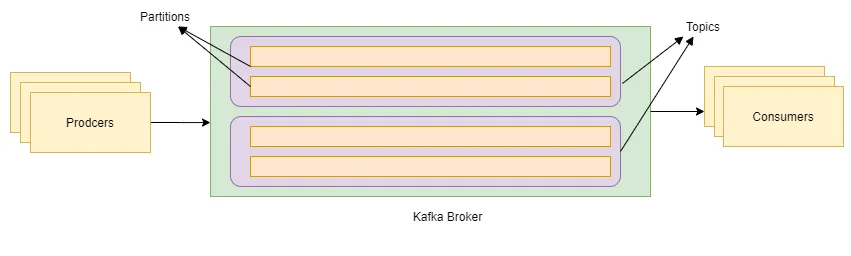
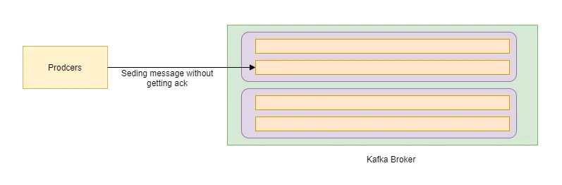
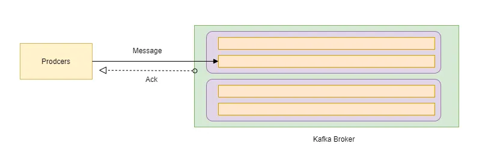
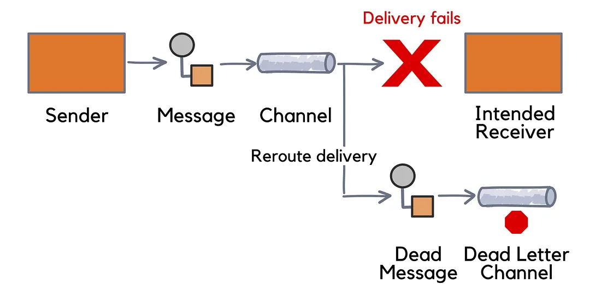

# Chapter 7: Kafka Message Delivery Semantics

- [7.1 At-Most-Once, At-Least-Once, Exactly-Once](#71-at-most-once-at-least-once-exactly-once-️)
- [7.2 Idempotent Producers](#72-idempotent-producers-️)
- [7.3 Kafka Transactions](#73-kafka-transactions-)
- [7.4 Dead Letter Topics in .NET](#74-dead-letter-topics-in-net-️)
- [7.5 Error Handling Patterns](#75-error-handling-patterns-️)

---

## 7.1 At-Most-Once, At-Least-Once, Exactly-Once ⚖️



### Context and Explanation

When building any **distributed system**, a core challenge is guaranteeing message delivery in the face of network outages, machine failures, and other unpredictable events. Kafka provides different levels of guarantees, known as delivery semantics, that you can choose from based on your application's reliability needs.

- **At-Most-Once:** This is the most permissive delivery guarantee. The producer sends a message and doesn't wait for a confirmation from the broker. It's a "send and forget" approach.  
  

  - **How it Works:** The producer sends a message and moves on to the next one immediately. It doesn't perform any retries if the network connection fails.
  - **Problems it Solves:** This semantic is all about speed and throughput. It's the fastest option because there is no waiting time or retry overhead.
  - **Problems it Creates:** Since there's no confirmation, a message can be lost if a failure occurs before the broker can write it to the log. This is often unacceptable for critical data.
  - **Analogy:** This is like sending a postcard. You put it in the mailbox, and you have no way of knowing if it ever arrived. It might get lost, but it will never arrive twice.

- **At-Least-Once:** This is the default and most common delivery guarantee. The producer sends a message and waits for an acknowledgment from the Kafka broker that the message was received. If it doesn't receive a confirmation, it will retry sending the message.  
  

  - **How it Works:** The producer is configured to wait for a positive acknowledgment from the broker. If it times out or receives an error, it will automatically resend the message until it gets a success confirmation.
  - **Problems it Solves:** This semantic guarantees that no messages will be lost. Your data is safe.
  - **Problems it Creates:** Because of the retry logic, a message might be written to the Kafka log more than once if a confirmation is sent but lost on the network. The producer thinks the message failed and retries, even though the broker already has the message. This leads to duplicate messages.
  - **Analogy:** This is like sending an email with a "read receipt" request. If you don't get the receipt, you might resend the email. The recipient might get the email twice, but at least they'll get it.

- **Exactly-Once:** This is the strongest and most complex delivery guarantee. It ensures that each message is delivered to a consumer and processed exactly once, with no loss and no duplication.

  - **How it Works:** This semantic is not a single setting but a combination of Kafka features. It requires the producer to be idempotent and for the producer and consumer to work together within a transaction. The system ensures that the message is written to the log exactly once and that the consumer's offset is committed only after the message is successfully processed.
  - **Problems it Solves:** This semantic solves both message loss and message duplication. It's essential for applications where data consistency is paramount, like financial transactions or inventory management.
  - **Analogy:** This is like a bank transfer with a unique transaction ID. The system ensures the money is debited and credited exactly once, even if the network fails during the process.

**Example:**

```csharp
var atMostOnceConfig = new ProducerConfig
{
    // Acks.None means the producer won't wait for any acknowledgment.
    Acks = Acks.None
};

var atLeastOnceConfig = new ProducerConfig
{
    // Acks.All means the producer will wait for all in-sync replicas to confirm.
    Acks = Acks.All
};
```

---

## 7.2 Idempotent Producers 🛡️

### Context and Explanation

The biggest drawback of the at-least-once delivery semantic is the potential for duplicate messages. This happens when a producer retries a message that was already successfully written to the Kafka broker but the acknowledgment was lost. An idempotent producer is a feature designed to solve this specific problem.

An idempotent producer guarantees that a message will be written to the Kafka log exactly once, even if the producer has to retry the send request. It's a fundamental building block for achieving exactly-once semantics.

### How it Helps

To achieve this, the Kafka broker and the producer work together using a special protocol:

- **Unique Producer ID:** When an idempotent producer starts up, it requests a unique ProducerId from the Kafka broker.
- **Sequence Numbers:** The producer then assigns a unique and increasing sequence number to every message it sends to a specific topic-partition.
- **Broker's Role:** The broker keeps track of the ProducerId and the last sequence number it received for each partition.
- **Detecting Duplicates:** If a producer retries a message and the broker receives it with the same ProducerId and a sequence number that has already been seen, the broker simply discards the duplicate message without writing it to the log.

### Problems Solved

Idempotence eliminates the problem of duplicate messages that arise from a producer's automatic retries, which is a very common scenario in distributed systems. It makes producer applications much more resilient and reliable without requiring complex custom logic in your code.

**Example:**

```csharp
var config = new ProducerConfig
{
    BootstrapServers = "localhost:9092",
    // This single setting enables idempotence.
    // It automatically sets Acks=All and other necessary configs.
    EnableIdempotence = true
};

using var producer = new ProducerBuilder<Null, string>(config).Build();
```

---

## 7.3 Kafka Transactions 🔒

### Context and Explanation

While idempotence ensures that a single producer won't create duplicate messages, it doesn't solve the problem of atomic operations across multiple partitions or topics. The core problem transactions solve is guaranteeing the "all-or-nothing" principle in a "read-process-write" pattern.

Kafka transactions allow you to group a set of producer writes and consumer offset commits into a single, atomic unit. All changes made within a transaction are either committed successfully and become visible to other consumers, or they are aborted and none of the changes are visible.

### How it Helps

Imagine a service that reads messages from an input topic and writes them to an output topic. Without transactions, a failure could occur after the message is written to the output topic but before the offset is committed for the input topic. This would cause the message to be re-read and re-processed, leading to a duplicate in the output topic. A transaction ensures this can't happen.

### Problems Solved

Transactions are the key to building robust data pipelines and stream processing applications that require exactly-once semantics from end to end.

**Example:**

```csharp
var producerConfig = new ProducerConfig
{
    BootstrapServers = "localhost:9092",
    // A TransactionalId is required for transactional producers.
    TransactionalId = "my-transactional-producer"
};

using var producer = new ProducerBuilder<Null, string>(producerConfig).Build();
using var consumer = new ConsumerBuilder<Null, string>(consumerConfig).Build();

// Step 1: Initialize the transaction.
producer.InitTransactions(TimeSpan.FromSeconds(10));

try
{
    producer.BeginTransaction(); // Step 2: Start the transaction.

    // Read a message from the input topic.
    var consumeResult = consumer.Consume();

    // Produce a new message to the output topic.
    producer.Produce("my-output-topic", consumeResult.Message);

    // Step 3: Commit the consumer offset to the same transaction.
    producer.SendOffsetsToTransaction(consumeResult.TopicPartitionOffset, consumer.ConsumerGroupMetadata);

    producer.CommitTransaction(); // Step 4: Commit all changes atomically.
}
catch (KafkaException)
{
    // Step 5: If any part fails, abort the transaction to roll back.
    producer.AbortTransaction();
}
```

---

## 7.4 Dead Letter Topics in .NET ⚰️

### Context and Explanation

In a real-world application, it's inevitable that some messages will be "bad." They might be malformed, contain corrupted data, or trigger a logic error in your code. These "poison pill" messages can cause a consumer to get stuck in a retry loop. A Dead Letter Topic (DLT) is a pattern designed to handle this problem gracefully.



### How it Helps

A Dead Letter Topic is a separate, dedicated topic used to store messages that fail to be processed after a certain number of retries. When a consumer encounters a message it can't handle, instead of blocking, it publishes the message to the DLT and then commits the offset for that message in the original topic.

This makes your consumer more resilient and prevents a single bad message from bringing down your entire pipeline.

### Problems Solved

- **Prevents Blocking:** Solves the "poison pill" problem by moving the problematic message out of the main stream.
- **Centralized Failure Point:** Provides a single location to collect and inspect all failed messages.

**Example:**

```csharp
// Consumer setup...
// DLT producer setup...
string deadLetterTopic = "my-dead-letter-topic";

while (true)
{
    var consumeResult = consumer.Consume();

    try
    {
        // Attempt to process the message.
        // ... processing logic here ...
        consumer.Commit(consumeResult);
    }
    catch (Exception)
    {
        // If an exception occurs, write the failed message to the DLT.
        await dltProducer.ProduceAsync(deadLetterTopic, consumeResult.Message);

        // IMPORTANT: Commit the offset for the failed message in the original topic
        consumer.Commit(consumeResult);
    }
}
```

---

## 7.5 Error Handling Patterns 🛠️

### Context and Explanation

In a distributed system like Kafka, errors are not an exception; they are a part of normal operation. A robust application must be designed to handle a wide range of errors. Effective error handling is the key to building a reliable and self-healing system.

### Best Practices

- **Defensive Consumer Design:**

  - **Manual Offset Commits**: As discussed in previous chapters, use manual commits to ensure a message is only marked as processed after your application has successfully handled it.

  - **Idempotent Operations** : Design your message processing logic to be idempotent. This means that if your code processes the same message twice, it should not cause any negative side effects. This is the best defense against unexpected duplicates.

- **Retry Logic:**

  - **Distinguish Errors (transient vs permanent):** Not all errors are the same. A network timeout is a transient error that you should retry. A data serialization error is likely a permanent error that you should not retry.
  - **Exponential Backoff:** If you implement a retry mechanism, don't retry immediately. Wait a little longer with each retry attempt. This gives a temporary bottleneck time to recover without overwhelming it.

- **Dead Letter Topic (DLT):**

  - **Safety Valve:** Use the DLT pattern for messages with permanent failures. It ensures that a single bad message doesn't stop your consumer from processing the rest of its assigned work.
  - **Context is Key:** When you write a message to the DLT, make sure you include important headers in the message, such as the original topic, the partition, the offset, and the reason for the failure. This information is invaluable for debugging later.

- **Centralized Logging and Monitoring:**

  - **Structured Logging:** Your application should log detailed information about errors, including the topic, partition, offset, and the stack trace. Use a structured logging framework so that these logs can be easily queried and analyzed.
  - **Alerting:** Set up monitoring and alerts on key metrics, such as the number of messages being sent to your DLT. An increase in DLT messages is a strong signal that something is wrong with your data or your application logic.

---

### References

- [Understanding message delivery semantics in Kafka](https://harshit-sharma.medium.com/understanding-message-delivery-semantics-in-kafka-3d12f6bdbde3)
- [Kafka exception handling and retry mechanism](https://medium.com/@cobch7/kafka-exception-handling-and-retry-mechanism-a911541321fe)
- [Apache Kafka Transactions](https://medium.com/shoutloudz/apache-kafka-transactions-349ad4617856)
