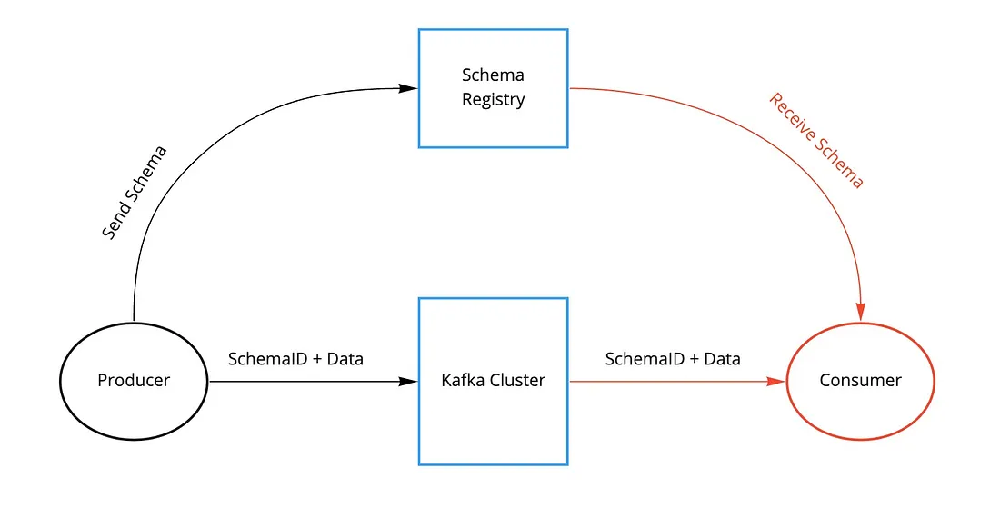
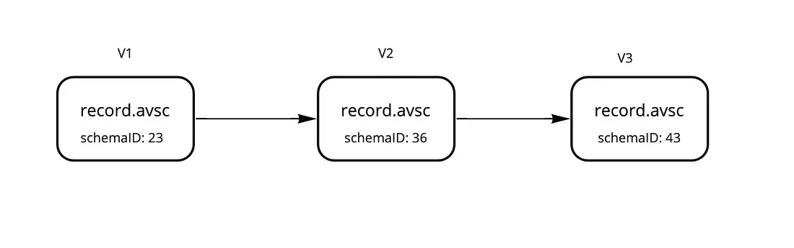
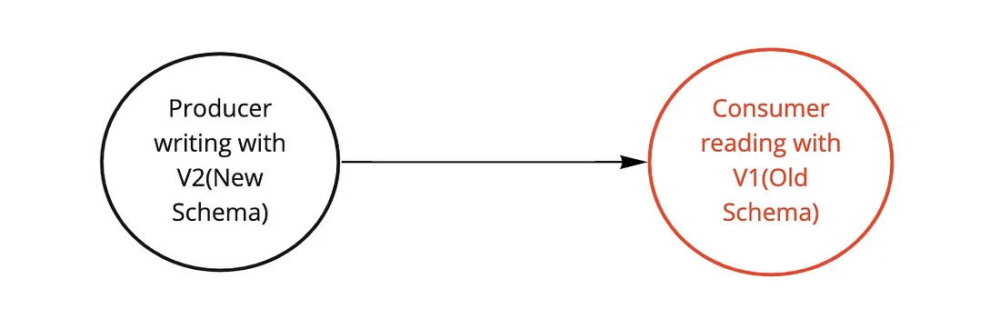

# Chapter 8: Schema Management and Serialization

- [8.1 Introduction to Schema Registry](#81-introduction-to-schema-registry-)
- [8.2 Avro, Protobuf, JSON Schema Overview](#82-avro-protobuf-json-schema-overview-)
- [8.3 Integrating Schema Registry with .NET](#83-integrating-schema-registry-with-net-)
- [8.4 Handling Schema Evolution](#84-handling-schema-evolution-)
- [8.5 Configuring Compatibility Settings](#85-configuring-compatibility-settings-)

---

## 8.1 Introduction to Schema Registry 📝



### Context and Explanation

In a distributed system, a key challenge is ensuring that all services agree on the format of the data they exchange. Without a centralized way to manage data formats, a producer might change the structure of its messages (e.g., add or remove a field), and older consumers that are not aware of this change could fail to deserialize the data correctly. This can lead to silent data corruption, application crashes, and a lot of headaches for developers.

The Schema Registry is a service that solves this problem by acting as a centralized repository for all your data schemas. Instead of embedding a full schema in every message—which would add significant overhead—a producer registers its schema with the registry and gets a unique ID. It then sends this small ID (typically a 4-byte integer) along with the message data. The consumer, upon receiving the message, uses the ID to fetch the correct schema from the registry and deserialize the message correctly. This approach ensures all services are always working with the exact, valid data structure.

### How it Helps and Problems it Solves

- **Centralized Management**: It provides a single location to manage and version all your schemas. This means you have a clear, authoritative record of what your data looks like at any given time.
- **Data Integrity**: It ensures that a producer cannot accidentally write a message that violates the expected schema. The serializer will fail at the source, protecting the integrity of your data stream.
- **Reduced Overhead**: It drastically reduces the size of each message. By replacing a large, verbose schema with a small integer ID, you save a significant amount of bandwidth, which is critical for high-throughput systems.
- **Simplifies Schema Evolution**: The registry is designed to handle schema changes gracefully. It can enforce compatibility rules that prevent you from making a change that would break your existing producers or consumers.

### Example Scenario

Imagine a ride-sharing company where a producer service sends ride requests to a topic. The initial message contains just the latitude and longitude of the pickup.

- **Without a Schema Registry**: The producer decides to add a `rider_id` field. The new consumer is upgraded to handle this, but the old consumer, which is still running, tries to read the new message. Since it doesn't know about `rider_id`, it might throw an error or silently ignore the new data, leading to inconsistent behavior.

- **With a Schema Registry**:
  1. The producer service registers its initial schema (with just latitude and longitude) with the Schema Registry.
  2. The producer service serializes its message and sends it to Kafka with a schema ID (e.g., ID 1).
  3. A consumer service receives the message, looks up schema ID 1, and correctly deserializes the data.
  4. Later, the producer is updated to add the `rider_id` field. It registers this new schema with the Schema Registry, which assigns it a new ID (e.g., ID 2).
  5. A new consumer service is deployed. It receives a message with schema ID 2, fetches the new schema, and correctly deserializes all three fields. The old consumer still works because it only receives messages with schema ID 1.

## 8.2 Avro, Protobuf, JSON Schema Overview 📦

### Context and Explanation

The Schema Registry is a neutral tool; it can store and manage schemas for various formats. The choice of which serialization format to use is a critical design decision. Each format has different strengths and weaknesses, especially regarding performance, message size, and schema flexibility. The most popular choices are Avro, Protocol Buffers (Protobuf), and JSON Schema.

### Avro

- **What it is**: Avro is a data serialization system developed as part of the Hadoop project. Its schema is defined using JSON, making it human-readable, but the data itself is serialized into a compact, efficient binary format. The Avro library uses the schema to read and write the data, which means the schema is a fundamental part of the process.

#### How it Helps

- **Schema Evolution**: Avro was built with schema evolution in mind, providing robust support for compatibility changes. For example, you can easily add a new field to your schema, and older consumers can still read the data, ignoring the new field.
- **Compactness**: By not including field names with every single message, Avro produces very small messages, which is excellent for high-volume data streams where bandwidth is a concern.

#### Example Scenario

You're building a massive IoT pipeline that ingests sensor data from millions of devices. The data format might evolve as new sensors are added, and message size is critical for cost and performance. Avro is an excellent choice here because of its compact binary format and strong support for schema changes.

### Protocol Buffers (Protobuf)

- **What it is**: Protobuf is a high-performance binary format developed by Google. You define your data structure in a `.proto` file, and a compiler generates code in your chosen language. This code is then used for fast serialization and deserialization.

#### How it Helps

- **Performance**: Protobuf is generally considered one of the fastest serialization formats, making it ideal for low-latency applications.
- **Strong Typing**: The code generation process gives you strongly typed data models in your application, which helps catch errors at compile time.
- **Flexibility**: It's language-agnostic, with code generators for most popular programming languages.

#### Example Scenario

Your company is running a real-time trading platform where a new price quote needs to be sent to multiple services as quickly as possible. Every millisecond counts. Protobuf's focus on speed and efficiency makes it the perfect fit for this kind of low-latency, performance-critical system.

### JSON Schema

- **What it is**: JSON Schema is a standard for describing the structure and validation rules for JSON data. Unlike Avro and Protobuf, the data itself is serialized in the human-readable JSON text format.

#### How it Helps

- **Readability**: Since the data is in plain text, it's very easy for a human to inspect a message, which is great for debugging and development.
- **Widespread Support**: JSON is a universal format, so it's easy to integrate with almost any tool or language without needing a special library or code generator.
- **Flexibility**: It's a non-binary format, which makes it easy to work with in shell scripts and other simple tools.

#### Example Scenario

You're building a content management system where various microservices communicate using Kafka. The messages might be complex, and developers need to be able to easily read and understand the message content for debugging. Using JSON Schema provides this human-readable format while still giving you a way to validate the data structure with the Schema Registry.

### Comparison Summary

| Feature              | Avro         | Protobuf     | JSON Schema |
| -------------------- | ------------ | ------------ | ----------- |
| **Data Format**      | Binary       | Binary       | Text        |
| **Performance**      | High         | Very High    | Lower       |
| **Message Size**     | Very Small   | Small        | Larger      |
| **Readability**      | Low (binary) | Low (binary) | High (text) |
| **Schema Evolution** | Excellent    | Good         | Good        |

### Examples

#### Avro Schema Representation

```json
{
  "type": "record",
  "name": "User",
  "namespace": "com.example.avro",
  "fields": [
    {
      "name": "Name",
      "type": "string"
    },
    {
      "name": "Age",
      "type": "int"
    }
  ]
}
```

#### Protocol Buffers (Protobuf) Schema Representation

```protobuf
syntax = "proto3";

package com.example.protobuf;

message User {
  string Name = 1;
  int32 Age = 2;
}
```

#### JSON Schema Representation

```json
{
  "$schema": "http://json-schema.org/draft-07/schema#",
  "title": "User",
  "type": "object",
  "properties": {
    "Name": {
      "type": "string",
      "description": "The user's name."
    },
    "Age": {
      "type": "integer",
      "description": "The user's age."
    }
  },
  "required": ["Name", "Age"]
}
```

## 8.3 Integrating Schema Registry with .NET 💻

### Context and Explanation

When working with Kafka in a .NET environment, the core client library is Confluent.Kafka. However, this library is focused on the low-level details of producing and consuming messages. To leverage the power of the Schema Registry, you need additional tools that handle the serialization and deserialization of messages in a way that is compliant with the schemas stored in the registry.

This is where the specialized Confluent packages come in. You'll primarily use:

- **Confluent.SchemaRegistry**: This package provides a client, typically `CachedSchemaRegistryClient`, that manages the communication with your Schema Registry instance. It handles tasks like registering new schemas, retrieving existing ones by their ID, and caching them to avoid making a network call for every single message.
- **Confluent.SchemaRegistry.Serdes.Avro**: This package provides the `AvroSerializer` and `AvroDeserializer`. These are the core components that bridge your C# objects with the Schema Registry.

The process works like this:

**On the Producer side**:

1. You create a .NET object (e.g., a `User` class).
2. You use an `AvroSerializer<T>` to serialize this object.
3. The serializer checks if the schema for this object (based on its type and topic) is already in its cache.
4. If not, it communicates with the `CachedSchemaRegistryClient` to register the schema (if `AutoRegisterSchemas` is enabled) or retrieve its ID.
5. It then takes the schema ID, a "magic byte" (a single byte used to identify the format), and the binary-encoded object data and combines them into a single byte array.
6. This combined byte array is the final message payload sent to Kafka.

**On the Consumer side**:

1. A consumer receives a message payload from Kafka.
2. An `AvroDeserializer<T>` extracts the magic byte and the schema ID from the beginning of the payload.
3. It uses the `CachedSchemaRegistryClient` to fetch the schema corresponding to that ID from the registry (using its cache if available).
4. With the retrieved schema, it correctly deserializes the remaining binary data back into the original .NET object.

This seamless process abstracts away all the complexity, allowing your application code to work with standard .NET objects while the underlying libraries handle the robust, schema-driven serialization and deserialization.

### Implementing with JSON Schema (Example) 💻

#### Context and Explanation

To implement Schema Registry with JSON Schema in .NET, the process is very similar to using Avro, but with one key difference: the serialization format. While Avro uses a compact binary format, JSON Schema keeps the message payload as a human-readable JSON string. This means the message on the wire is a combination of the Schema Registry's magic byte, the schema ID, and the standard JSON text.

The primary tool for this is the `Confluent.SchemaRegistry.Serdes.Json` NuGet package. It provides the `JsonSerializer<T>` and `JsonDeserializer<T>` that handle all the complexity of communicating with the registry and wrapping/unwrapping the schema ID from the message payload. The key benefit here is the ability to easily debug messages by reading their content, making it a great choice for scenarios where developer observability is a priority.

#### JSON Schema and .NET Class

First, let's define our JSON Schema and the corresponding C# class. The C# class doesn't need to implement any special interfaces, as the `JsonSerializer` uses standard reflection to serialize the object.

1. **The User Class**

   ```csharp
   // This is a Plain Old C# Object (POCO)
   public class User
   {
        public string Name { get; set; }
        public int Age { get; set; }
        public string Email { get; set; }
        public string Address { get; set; }
        public string PhoneNumber { get; set; }
        public DateTime CreatedAt { get; set; }
   }
   ```

2. **The JSON Schema**

   The JSON Schema is a separate string that defines the structure and validation rules for our User object. We will embed this directly in our code for simplicity.

   ```json
   {
     "$schema": "http://json-schema.org/draft-04/schema#",
     "title": "User",
     "type": "object",
     "additionalProperties": false,
     "properties": {
       "Name": { "type": "string" },
       "Age": { "type": "integer", "format": "int32" },
       "Email": { "type": "string" },
       "CreatedAt": { "type": "string", "format": "date-time" },
       "Address": { "type": "string" },
       "PhoneNumber": { "type": "string" }
     }
   }
   ```

#### The Producer (with JSON Schema)

The producer's job is to take a User object, serialize it using the `JsonSerializer`, and send it to Kafka. We'll explicitly configure the serializer with the JSON schema string. This ensures the schema is registered with the Schema Registry before any messages are sent.

```csharp
using Confluent.Kafka;
using Confluent.SchemaRegistry;
using Confluent.SchemaRegistry.Serdes;

public class JsonSchemaProducer
{
    // string agentTopic = "app-agent";

    public static async Task ProduceUserMessageAsync(string topicName, User user)
    {
      var schemaRegistryConfig = new SchemaRegistryConfig
      {
        Url = "http://localhost:8081"
      };

      var producerConfig = new ProducerConfig
      {
        BootstrapServers = "localhost:9092",
      };

      using var schemaRegistry = new CachedSchemaRegistryClient(schemaRegistryConfig);

      using var producer = new ProducerBuilder<string, User>(producerConfig)
          .SetValueSerializer(new JsonSerializer<User>(
              schemaRegistry,
              new JsonSerializerConfig
              {
                AutoRegisterSchemas = true,
                SubjectNameStrategy = SubjectNameStrategy.Topic  // Correct property name
              }))
          .Build();

      var message = new Message<string, User>
      {
        Key = user.Name,
        Value = user
      };

      try
      {
        var result = await producer.ProduceAsync(topicName, message);
        Console.WriteLine($"✅ Produced message to {result.TopicPartitionOffset} with key '{result.Message.Key}'.");

        var schema = await schemaRegistry.GetLatestSchemaAsync("app-agent-value");

        Console.WriteLine($"Schema ID: {schema.Id}");
        Console.WriteLine($"Version: {schema.Version}");
        Console.WriteLine($"Schema: {schema.SchemaString}");
      }
      catch (ProduceException<string, User> ex)
      {
        Console.WriteLine($"❌ Delivery failed: {ex.Error.Reason}");
        throw;
      }
    }
}
```

#### The Consumer (with JSON Schema)

The consumer's implementation is straightforward. It simply needs to use the `JsonDeserializer<T>` and point it to the Schema Registry. The deserializer will automatically retrieve the correct schema using the ID in the message and deserialize the JSON payload into a User object.

```csharp
using Confluent.Kafka;
using Confluent.Kafka.SyncOverAsync;
using Confluent.SchemaRegistry;
using Confluent.SchemaRegistry.Serdes;

public class JsonSchemaConsumer
{

     public static async Task ConsumeMessages()
        {
            var schemaRegistryConfig = new SchemaRegistryConfig
            {
                Url = "http://localhost:8081"
            };

            var consumerConfig = new ConsumerConfig
            {
                BootstrapServers = "localhost:9092",
                GroupId = "schema-registry-consumer-group",
                AutoOffsetReset = AutoOffsetReset.Earliest
            };

            using var schemaRegistry = new CachedSchemaRegistryClient(schemaRegistryConfig);
            using var consumer = new ConsumerBuilder<string, User>(consumerConfig)
                .SetValueDeserializer(
                    new JsonDeserializer<User>(schemaRegistry).AsSyncOverAsync()
                )
                .Build();

            consumer.Subscribe("app-agent");

            Console.WriteLine("Consuming messages from 'app-agent'...");

            try
            {
                while (true)
                {
                    var result = consumer.Consume();

                    var user = result.Message.Value;

                    Console.WriteLine(
                        $"Received: Key={result.Message.Key}, " +
                        $"Name={user.Name}, Age={user.Age}, Email={user.Email}, " +
                        $"Address={user.Address}, CreatedAt={user.CreatedAt}"
                    );
                    var schema = await schemaRegistry.GetLatestSchemaAsync("app-agent-value");

                    Console.WriteLine($"Schema ID: {schema.Id}");
                    Console.WriteLine($"Version: {schema.Version}");
                    Console.WriteLine($"Schema: {schema.SchemaString}");
                }
            }
            catch (OperationCanceledException)
            {
                consumer.Close();
            }
        }
}
```

## 8.4 Handling Schema Evolution 🔄



### Context and Explanation

In a real-world application, your data format will inevitably change over time. You might add a new field, remove an old one, or change a data type. This process is called schema evolution. The key challenge in a distributed system is to manage these changes gracefully so that you can upgrade your services independently. For example, you should be able to deploy a new version of your consumer without having to immediately update all your producers, and vice versa.

The Schema Registry, in conjunction with the serialization format, provides a framework to ensure these schema changes are safe. There are two primary types of compatibility that you need to be aware of:

### Backward Compatibility


- **What it is**: A new schema is backward-compatible if a new consumer (using the new schema) can successfully read messages produced by an old producer (using the old schema). This is the most common and useful compatibility mode.

- **How it Works**: In Avro, this typically involves adding a new field to the schema with a default value. When a new consumer receives a message from an old producer that doesn't have this field, the Avro deserializer automatically uses the default value, preventing an error.

- **Problems it Solves**: This is crucial for consumer-first upgrades. You can deploy a new version of your consumer that understands the new schema, and it will still be able to process all the old messages that were sent before the producer was updated. Your system can continue to run without interruption.

#### Example Scenario:

- Old Schema: `{"name": "string", "age": "int"}`
- New Schema: `{"name": "string", "age": "int", "email": "string", "default": "n/a"}`

A consumer running the new schema receives a message from a producer running the old schema. The consumer will correctly read name and age and will automatically use the default value "n/a" for the email field, without crashing.

### Forward Compatibility



- **What it is**: A new schema is forward-compatible if an old consumer (using the old schema) can successfully read messages produced by a new producer (using the new schema).

- **How it Works**: In Avro, this typically involves removing an optional field from the schema. An old consumer will simply ignore any new, unknown fields it encounters in the message.

- **Problems it Solves**: This is useful for producer-first upgrades. You can deploy a new producer that sends messages using the new schema, and you can be confident that all your old consumers will still be able to read the messages and extract the data they care about, even if they can't see the new fields.

#### Example Scenario:

- Old Schema: `{"name": "string", "age": "int", "phone": ["null", "string"]}`
- New Schema: `{"name": "string", "age": "int"}`

An old consumer expects to see a phone field. When it receives a message from a producer using the new schema, it will simply ignore the fact that the phone field is missing, as it was defined as optional.

Managing schema evolution correctly is a cornerstone of building a resilient, decoupled microservices architecture with Kafka. It allows you to update your services independently, giving you the flexibility and agility to evolve your system over time.

## 8.5 Configuring Compatibility Settings ✅

### Context and Explanation

Schema evolution is powerful, but it requires rules to prevent a new schema from breaking existing services. The Compatibility Settings in the Schema Registry are those rules. They act as a safeguard, ensuring that any new schema you register is valid according to the rules you've defined for a specific topic (or "subject," in Schema Registry terms). If a new schema violates the compatibility rule, the Schema Registry will reject it, preventing a potentially breaking change from ever reaching your message bus.

These settings can be configured globally for the entire registry or on a per-subject basis, giving you granular control. The most common compatibility levels are:

- **NONE**: This is the most lenient setting. The Schema Registry performs no compatibility checks. You can register any schema, regardless of whether it breaks existing producers or consumers. This is generally only suitable for development environments or special use cases where you have other mechanisms to ensure compatibility.

- **BACKWARD**: This is the default and most recommended setting. A new schema is backward-compatible if a consumer using the new schema can read messages produced with all previous schemas for that subject. This is the ideal setting for a consumer-first upgrade strategy, where you update your consumers to the new schema before you update your producers.

- **FORWARD**: A new schema is forward-compatible if an old consumer can read messages produced with the new schema. This is less common but can be useful for a producer-first upgrade strategy, where you update your producers to the new schema and older consumers can still read the data, although they might ignore new fields.

- **FULL**: A schema is full-compatible if it's both backward and forward compatible. This is the most restrictive setting and is the safest option. A schema change must be compatible with both new and old versions, which generally means you can only add fields with default values or remove fields with default values. It allows you to upgrade producers and consumers in any order without risking a break.

### Example Implementation: Configuring Compatibility

You can configure the compatibility level programmatically or via a command-line tool. Below are examples for both methods.

1. **Using the `Confluent.SchemaRegistry.AdminClient` in C#**

This code snippet shows how you can programmatically set the compatibility level for a specific topic's schema subject.

```csharp
using Confluent.SchemaRegistry;

public static class SchemaRegistryHelper
{
    public static async Task SetCompatibilityAsync(string schemaRegistryUrl, string topicName, Compatibility compatibility)
    {
        var config = new SchemaRegistryConfig
        {
            Url = schemaRegistryUrl
        };

        using var client = new CachedSchemaRegistryClient(config);

        // Schema subjects follow: <topic>-value
        var subjectName = $"{topicName}-value";

        Console.WriteLine($"Setting compatibility for subject '{subjectName}' to {compatibility}...");

        try
        {
            await client.UpdateCompatibilityAsync(compatibility, subjectName);
            Console.WriteLine($"Compatibility for '{subjectName}' updated to {compatibility}.");
        }
        catch (SchemaRegistryException ex)
        {
            Console.WriteLine($"Failed to update compatibility: {ex.Message}");
        }
    }
}
```

2. **Using the confluent Command-Line Tool**

If you have the Confluent CLI installed, you can easily manage compatibility settings from your terminal without writing any code.

To get the current compatibility setting for a subject:

```bash
confluent schema-registry subject config get my-users-topic-value
```

To update the compatibility setting to FULL:

```bash
confluent schema-registry subject config set my-users-topic-value --compatibility-level FULL
```

- [Introduction to Schema Registry in Kafka](https://medium.com/slalom-blog/introduction-to-schema-registry-in-kafka-915ccf06b902)

- [Schema Registry for Kafka](https://medium.com/@cobch7/schema-registry-for-kafka-002efc74eb7a)

- [YouTube Video on Schema Registry](https://youtu.be/EIaQsXvbmro)
